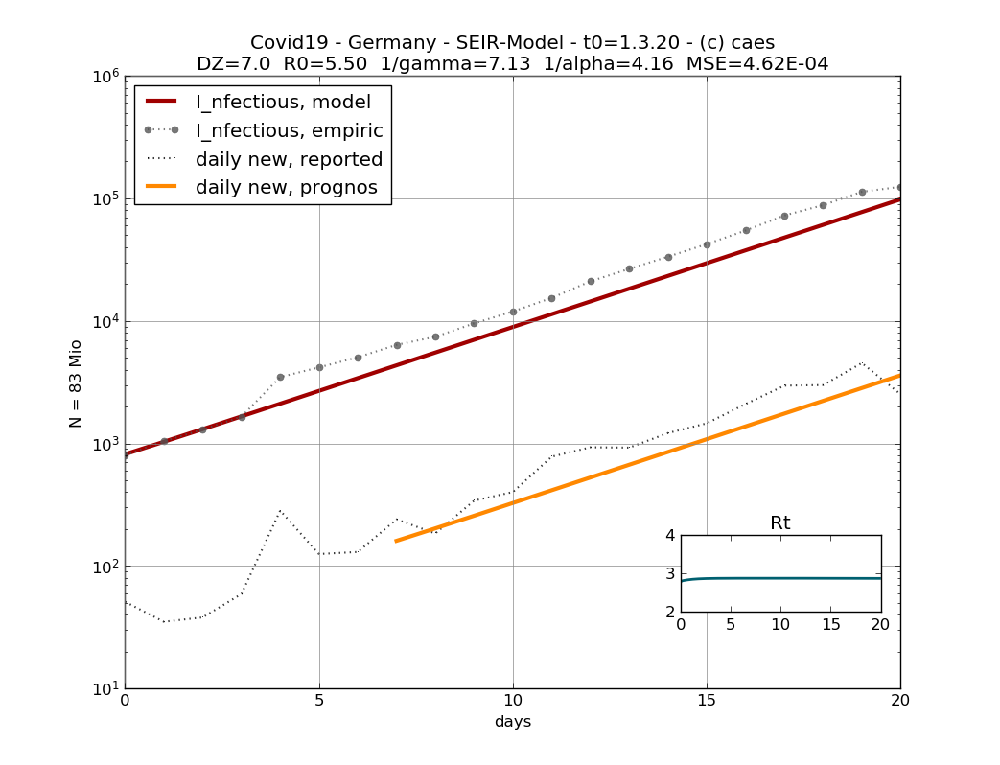
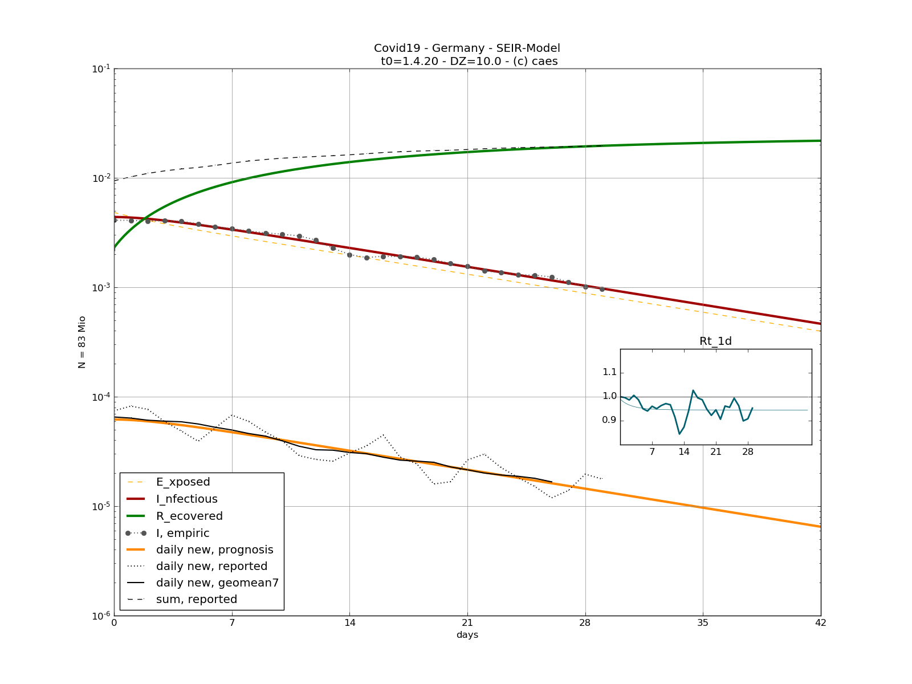

# covid19-germany
## SEIR-Modell in Python

Different stages of the Covid19 epidemic in Germany are simulated and plotted. Some parameters are given according to epidemic research, others fit by a simple algorithm (MSE optimization). Pay attention to numeric output in the shell. Feel free to create your own variations. 


Exponential growth stage in March 2020

- straight slope (logarithm y-scale) 
- doubling time 2.9 days
- prominent offset at Mar 5, most likely caused by carnival and ski tourism


April 2020

Fitting params: 
```
[Rt_1d  Rt_SI  Rt_4d]       = 0.9445 0.6873 0.7959
[SI     T2     MSE]         = 6.5726 12.150 2.7671e-03
[R0 1/beta 1/alpha 1/gamma] = 0.5810 7.0103 4.5361 4.0730
```
