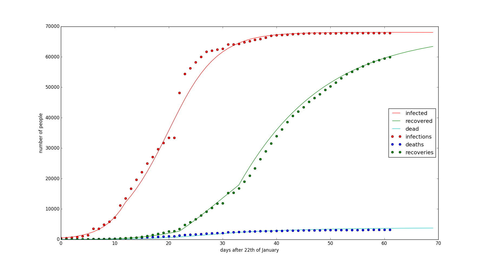
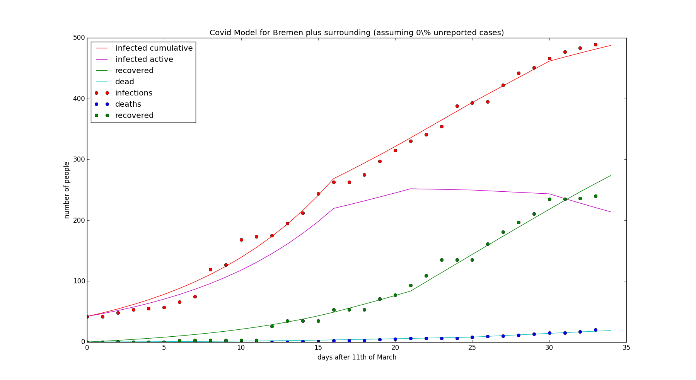
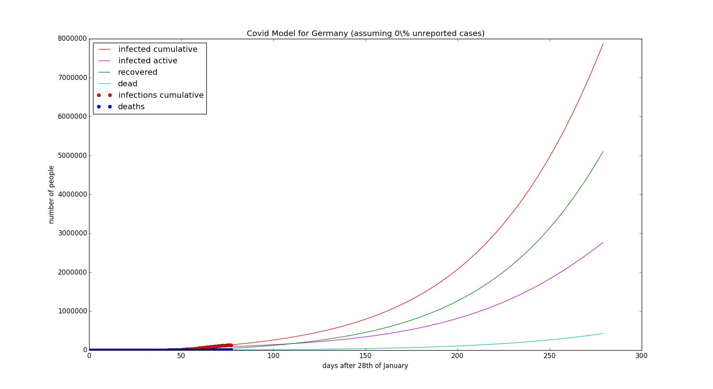
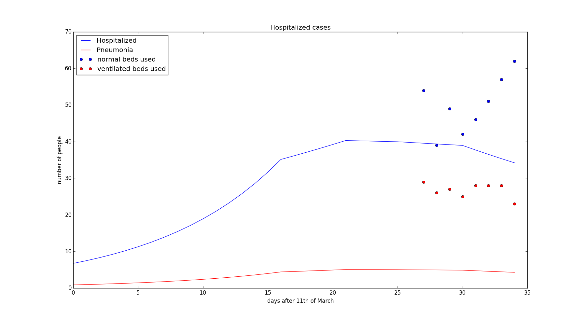

# SARS-Cov2 model
Calulate the spread of the new corona virus SARS-Cov2 among the population of 
Germany with special emphasis on the federal state of Bremen.

# General description
The model is set up as a SIRD-model considering the group of susceptible (S), 
infected (I), recovered (R), and dead (D) individuals. This repository includes 
three different versions of the model that are set up for the entire German 
population, for the subpopulation of the federal state Bremen including some of 
the closer surrounding of Bremen belonging to lower saxony because Bremen also 
provides the hospital infrastructure for these regions, and for the province of 
Hubei that includes the city of Wuhan where the new virus was first detected and 
where the first wave of infections can be used to constrain especially the 
recovery rate of infected individuals. 

# Model description
The group of potentially susceptible people in Germany is supposed to be the 
entire population of around 83 million people. In order to create a reasonable 
background scenario (without viral infection) I set up the population at around 
81.9 million people which is the average population size over almost the last 30 
years. I included the average birth rate and the average mortality rate in order 
to allow for reasonable developments for longer simulation scenarios. 
Interestingly, birth minus mortality leads to a faster decline than the 
development of the German population would suggest. This gave hints towards the 
necessity to include migration from external countries in order to explain the 
development of the population size over the last 30 years. All these processes 
were constrained using data from the Statistisches Bundesamt.

In the current model version, these processes are commented out because I found 
that on the short time scales they do not play such a critical role. However, 
they are implemented and can easily be switched on.

The infection of people depends on the contact rate of susceptible 
people with infected people (c) and on the probability (a) that the disease is 
transmitted upon contact. In the equation, it is the product of a * c * S * I that 
describes the increase of infected cases but I like to keep the parameters 
separated to better assess where mitigation scenarios can be effective in the 
model.

The recovery from the infection is parameterized with a linear function (rho*I) 
and the recovery rate (rho) is constrained using data from the province Hubei in 
China and with data collected in Bremen. 

  

  

The same recovery rate is then also 
used in the model setup for whole Germany. Mortality of a relative fraction of 
infected individuals is a sink to the infected group and adds asa source to the 
group of dead individuals. This latter group is probably the best constrained 
group by the collected data because, at least in Germany, the causal relationship 
between the viral infection and the dead of an individual is critically assessed.

  

On the contrary, the number of infected people may actually be much higher than 
what the official numbers report because of undetected cases with mild symptoms 
that can still spread the disease. However, in the current model version I do 
not try to resolve the unknown cases because they cannot be constrained by any 
strong data basis. The number of undetected infected cases could be assessed 
with different methods that I am not expanding in the current version of the 
code.

After recovery from the infection, the model currently assumes immunity and no 
possibility of reinfection or transmission (even if this is currently questioned 
by latest research). I did, however, implement the possibility of reinfection in 
the code, i.e. recovered individuals becoming susceptible again, but the 
probability for this is currently set to zero.  

# Aim of the model
The purpose of this model is to provide relatively realistic scenarios to 
inform the local politicians of the Bremen Senate about the expected number of 
intensive care beds (including ventilators) that need to be provided in due time. 
In order to do this, I used the percentages of the different symptoms that are 
provided by the RKI, which I took from the web portal statista.de. These data 
suggested earlier that 13% of infected cases needed to be hospitalized (this number was 
recently corrected to 16%) and that 2% of infected people develop pneumonia and 
therefore require ventilation. 

  

However, in retrospect, the data provided by the 
RKI do not match the current use of hospital ressources in Bremen and therefore 
either need to be corrected to realistically predict the intensive care 
requirements in Bremen or these numbers may be used to determine undetected 
infections if the RKI data are truly reliable.

  

# Requirements
The model is programmed in Python and requires the packages numpy and 
matplotlib.pyplot.

Run the model either from the Terminal typing: 

python SIR_model_Bremen_DZ0.py

or

python SIR_model_Germany.py

# Compatibilities
The model should run fine on any Python version, except for the plotting, where 
Python versions older than 2.8.4 seem to have problems with the legend. To avoid 
this, simply remove the labels from the plot command and do not call the legend.

