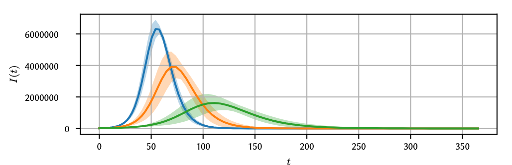
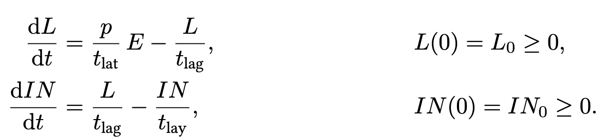

# Modeling pandemics subject to stochastic uncertainties -- A polynomial chaos approach

The so-called [SEIR model](https://epubs.siam.org/doi/abs/10.1137/s0036144500371907) is commonly used to model the outbreak of pandemics.
The plain SEIR model consists of four differential equations, modeling the dynamics of *s*usceptible, *e*xposed, *i*nfected, and *r*ecovered people.
Undeniably, a portion of infected people needs intensive care.
To account for this fact variants of the model exist, [see for instance here for the current Covid-19 pandemic (German)](https://www.dgepi.de/assets/Stellungnahmen/Stellungnahme2020Corona_DGEpi-21032020-v2.pdf), or [here (German)](https://www.rki.de/DE/Content/InfAZ/N/Neuartiges_Coronavirus/Modellierung_Deutschland.pdf?__blob=publicationFile), or [here (English)](https://www.imperial.ac.uk/media/imperial-college/medicine/sph/ide/gida-fellowships/Imperial-College-COVID19-NPI-modelling-16-03-2020.pdf).
As with every mathematical model there are parameters that need to be chosen.
Usually, not precise figures exist.
Hence, uncertainty quantification can play a vital role.

## General resources (mostly Germany-related)

| Resource | Explanation |
| --- | --- |
| [corona.rki.de](https://corona.rki.de) | Dashboard by Robert Koch Institut; goes down to communal level |
| [corona.rki.de -- API](https://npgeo-corona-npgeo-de.hub.arcgis.com/datasets/dd4580c810204019a7b8eb3e0b329dd6_0) | API for resource from above |
| [RKI - Meldedaten](https://www.rki.de/DE/Content/Infekt/SurvStat/survstat_node.html) | Meldedaten nach Infektionsschutzgesetz, Robert Koch Institut |
| [Epidemiologisches Bulletin](https://www.rki.de/DE/Content/Infekt/EpidBull/epid_bull_node.html) | by Robert Koch Institut |
| [Epidemic calculator](https://gabgoh.github.io/COVID/index.html) | Epidemilogical simulation tool |
| [CovidSim](http://covidsim.eu/) | Epidemilogical simulation tool (for Europe)|
| [Risklayer Explorer](http://www.risklayer-explorer.com/) | This company grew out ouf [KIT](www.kit.edu); they still work together closely. Provides more than just information about Germany. |
| [The Mathematics of Infectious Diseases](https://epubs.siam.org/doi/abs/10.1137/s0036144500371907) | Great SIAM paper by Herbert W. Hethcote |
| [Data against Covid](https://www.data-against-covid.org/) | Initiative to share and provide expertise |
| [Estimating $R_0$](https://stochastik-tu-ilmenau.github.io/COVID-19/germany) | Estimation of basic reproduction number for Germany |
| [SIAM Resources for Covid-19](https://sinews.siam.org/Details-Page/mathematical-resources-to-help-understand-covid-19) | Excellent collection of online resources |

## Results

The code introduces uncertainty with respect to the basic reproduction number and the percentage of infected persons that require intensive care (see the [code](https://github.com/timueh/PandemicModeling/blob/f4da19ac8f859b7d5a74180123a80474a8c162d1/code/SEIR_uncertain.jl#L16) for precise numbers).
Unfortunately, the numbers sketch a rather glim future (here for the German scenario).
For instance, here is the number of infected patients over the course of one year.

And here the number of patients required intensive care

## Model

The basic equations for the SEIR model are ([see for example this excellent reference](https://gabgoh.github.io/COVID/index.html))

and we augment them by equations for patients requiring intensive care units (ICUs) [motivated by this press release](https://www.dgepi.de/de/aktuelles/article/aktualisierte-stellungnahme-der-deutschen-gesellschaft-fuer-epidemiologie-dgepi-zur-verbreitung-des-neuen-coronavirus-sars-cov-2/109)

## Code

The [code](code/SEIR_uncertain.jl) is written in [Julia](https://julialang.org/).
To run it, install all required packages. The main dependencies are [DifferenialEquations.jl](https://github.com/SciML/DifferentialEquations.jl) and [PolyChaos.jl](https://github.com/timueh/PolyChaos.jl).

## Documentation

This repository contains Julia code and a [documentation](doc/doc.pdf) to show how [polynomial chaos expansion](https://en.wikipedia.org/wiki/Polynomial_chaos) can help quantify uncertainties for the SEIR model.

